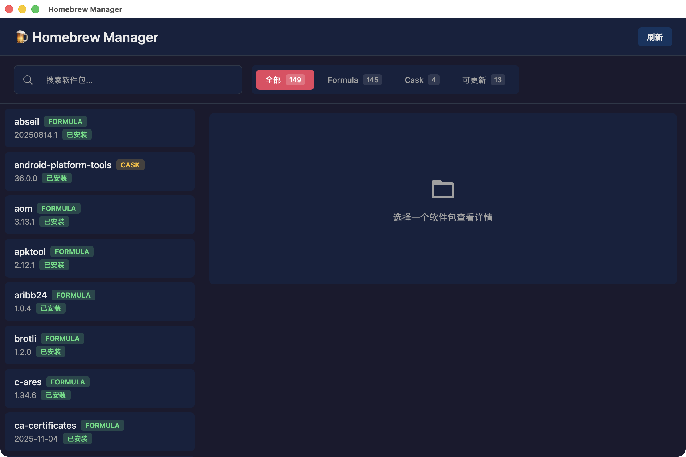

# 🍺 Homebrew Manager

一个基于 Tauri + React + TypeScript 构建的 macOS Homebrew 图形化管理工具。

## 功能特性

- 📦 查看所有已安装的 Homebrew 包（Formula 和 Cask）
- 🔍 搜索 Homebrew 仓库中的软件包
- ⬇️ 一键安装新软件包
- 🗑️ 一键卸载已安装的软件包
- 🔄 检测并更新过时的软件包
- 📊 实时显示安装/卸载进度
- 🎨 简洁美观的用户界面

## 截图



## 系统要求

- macOS 10.15+
- [Homebrew](https://brew.sh) 已安装

## 安装

### 下载安装

从 [Releases](https://github.com/YOUR_USERNAME/homebrew-manager/releases) 页面下载最新的 `.dmg` 文件，打开后将应用拖入 Applications 文件夹。

### 从源码构建

```bash
# 克隆仓库
git clone https://github.com/YOUR_USERNAME/homebrew-manager.git
cd homebrew-manager

# 安装依赖
npm install

# 开发模式运行
npm run tauri dev

# 构建生产版本
npm run tauri build
```

## 技术栈

- **前端**: React 18 + TypeScript + Vite
- **后端**: Rust + Tauri 2.0
- **样式**: CSS Modules

## 开发

```bash
# 安装依赖
npm install

# 启动开发服务器
npm run tauri dev
```

## 许可证

MIT License
